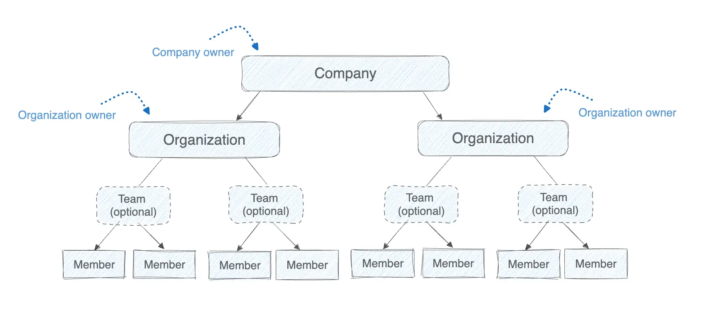

# 管理

组织和公司所有者可以管理成员、控制访问，并在其 Docker 环境中强制执行安全。你可以在 Docker Home 中执行这些任务，它提供集中的可观察性、访问管理和安全控制。

作为组织或公司所有者，你可以：

- 创建和管理公司与组织
- 为成员分配角色和权限
- 将成员分组到团队中，按项目或角色管理访问
- 设置公司范围内的策略，包括 SCIM 配置和安全强制执行

## 公司与组织层级结构

为了提供集中的管理，Docker 将公司和组织组织成以下层级结构和角色。

### 公司

公司用于对多个 Docker 组织进行集中配置。公司所有者可以查看和管理公司内的每个组织及其公司范围的设置，拥有与组织所有者相同的访问权限。有关公司所有者角色及其对席位的影响，请参阅
[公司角色](/manuals/admin/company/_index.md#company-roles)。

公司仅对 Docker Business 订阅用户开放。

### 组织

组织位于公司之下，是您对团队和成员进行分组并分配仓库访问权限的地方。每个 Docker Team 和 Business 订阅用户都至少拥有一个组织。

组织所有者持有组织所有者管理员角色，管理组织设置、用户和访问控制。每个所有者占用一个
[席位](/manuals/admin/organization/organization-faqs.md#what-is-the-difference-between-user-invitee-seat-and-member)。

[升级到 Docker Business 套餐](https://www.docker.com/pricing?ref=Docs&refAction=DocsAdmin)
可授予你公司所有者角色，以便管理多个组织。

### 团队

团队是可选的，允许您将成员分组以集体分配仓库权限。团队简化了跨项目或职能的权限管理。

### 成员

成员是添加到组织中的任何 Docker 用户。组织和公司所有者可以分配角色给成员，以定义其访问级别。

## 后续步骤

在以下章节中了解如何管理公司和组织。

