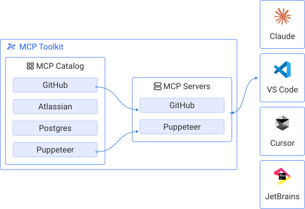

# Docker MCP Catalog and Toolkit

[Model Context Protocol](https://modelcontextprotocol.io/introduction) (MCP) 是一种开放协议，用于标准化 AI 应用程序访问外部工具和数据源的方式。通过将 LLM 连接到本地开发工具、数据库、API 和其他资源，MCP 扩展了其超越基础训练的能力。

通过客户端-服务器架构，Claude、ChatGPT 和 [Gordon](/manuals/ai/gordon/_index.md) 等应用程序充当客户端，向 MCP 服务器发送请求，然后服务器处理这些请求并将必要的上下文传递给 AI 模型。

MCP 服务器扩展了 AI 应用程序的实用性，但在本地运行服务器也带来了一些操作挑战。通常，服务器必须直接安装在您的机器上，并为每个应用程序单独配置。在本地运行不受信任的代码需要仔细审查，而保持服务器最新和解决环境冲突的责任则落在用户身上。

## Docker MCP 功能

Docker 提供了三个集成组件，用于解决运行本地 MCP 服务器的挑战：

MCP Catalog
: 一个经过验证的 MCP 服务器精选集合，通过 Docker Hub 作为容器镜像打包和分发。所有服务器都经过版本控制，附带完整的来源和 SBOM 元数据，并持续维护和更新安全补丁。

MCP Toolkit
: Docker Desktop 中用于发现、配置和管理 MCP 服务器的图形界面。Toolkit 提供了一种统一的方式来搜索服务器、处理身份验证以及将它们连接到 AI 应用程序。

MCP Gateway
: 为 MCP Toolkit 提供支持的核心开源组件。MCP Gateway 管理 MCP 容器，并提供一个统一的端点，将您启用的服务器暴露给您使用的所有 AI 应用程序。

这种集成方法确保：

- 从精选的工具目录中简化受信任 MCP 服务器的发现和设置
- 在 Docker Desktop 内进行集中配置和身份验证
- 默认情况下提供安全、一致的执行环境
- 由于应用程序可以共享单个服务器运行时，而不是为每个应用程序启动重复的服务器，从而提高了性能。

## 了解更多

