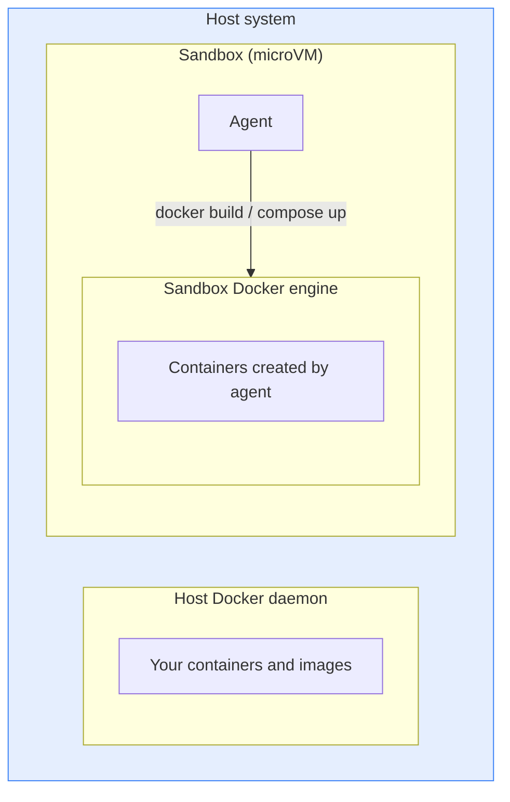
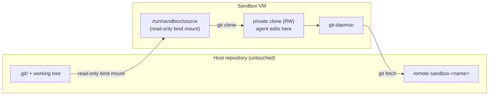

# 

<!-- FILE: manuals/ai/sandboxes/security/isolation.md -->

---
title: 隔离层
weight: 10
description: Docker Sandboxes 如何使用 hypervisor、网络、Docker Engine、工作区和凭据边界来隔离 AI agent。
keywords: docker sandboxes, isolation, hypervisor, network, credentials, workspace, git
aliases:
  - /ai/sandboxes/security/workspace/
---

AI 编程 agent 需要在你的机器上执行代码、安装包并运行工具。Docker Sandboxes 将每个 agent 运行在自己的 microVM 中。五层隔离保护你的宿主：hypervisor、网络、Docker Engine、工作区和凭据代理。

## Hypervisor 隔离

每个沙盒都在一个带有自己 Linux 内核的轻量级 microVM 内运行。与共享宿主内核的容器不同，沙盒 VM 无法访问其定义边界之外的宿主进程、文件或资源。

- **进程隔离：** 每个沙盒拥有独立的内核；VM 内部的进程对宿主和其他沙盒都不可见
- **文件系统隔离：** 你的工作区目录，以及对于尚未退出的受支持 agent 的专用[共享技能存储](../workflows.md#share-agent-skills)，会与宿主共享。VM 文件系统的其余部分在重启之间持续存在，但在你删除沙盒时被移除。指向工作区范围之外的符号链接不会被跟随。
- **完全清理：** 当你使用 `sbx rm` 移除沙盒时，VM 及其内部的一切都会被删除

agent 在 VM 内部以拥有 sudo 权限的非 root 用户运行。隔离控制是 hypervisor 边界，而不是 VM 内部的权限分离。

## 网络隔离

每个沙盒拥有自己隔离的网络。沙盒之间无法相互通信，也无法到达你宿主的 localhost。沙盒与沙盒之间、沙盒与你的宿主之间没有共享网络。

所有离开沙盒的 HTTP 和 HTTPS 流量都会经过你宿主上的一个代理，该代理强制执行[网络访问策略](../governance/access-controls/network.md)。沙盒根据客户端的配置通过前向代理或透明代理路由流量，两者都强制执行网络策略。只有前向代理[向 AI 服务注入凭据](credentials.md)。

原始 TCP 连接、UDP 和 ICMP 在网络层被阻止。DNS 解析通过代理进行，并受相同的网络策略约束——策略拒绝的域在解析器处被拒绝；像 `localhost` 这样的环回名称始终被解析，不受策略影响。到私有 IP 范围、环回和链路本地地址的流量也被阻止。只有策略中明确列出的域才可到达。

默认的允许域集，请参阅 [默认安全态势](defaults.md)。

## Docker Engine 隔离

agent 通常需要构建镜像、运行容器并使用 Docker Compose。将你的宿主 Docker socket 挂载进容器会让 agent 完全访问你的环境。

Docker Sandboxes 通过在沙盒环境内部运行一个独立的 [Docker Engine](/manuals/engine/_index.md)（与你的宿主隔离）来避免这种情况。当 agent 运行 `docker build` 或 `docker compose up` 时，这些命令针对该引擎执行。agent 没有通往你宿主 Docker 守护进程的路径。

这个 Docker Engine 边界适用于运行在沙盒 VM 内部的进程。它不适用于通过 [MCP 网关](../mcp-gateway.md) 注册的本地 stdio MCP 服务器。这些服务器运行在宿主上，在沙盒 VM 之外。如果本地 MCP 服务器启动了一个 Docker 容器，它使用的是宿主上的 Docker。

每个沙盒 VM 运行自己独立的 Docker Engine。agent 与引擎一起运行在 VM 内部，并在 VM 内驱动它来创建容器：

## 工作区隔离

当你创建一个沙盒时，你可以选择以下两种方式之一与你的工作区共享：

- **直接挂载**（默认）：agent 对你的工作树拥有读写访问。agent 的编辑与你的宿主文件系统之间没有边界。
- **克隆模式**（`--clone`）：你的仓库以只读方式挂载进 VM，agent 在 VM 内部的一个私有克隆上工作。在你将更改取回之前，agent 的编辑永远不会到达你的宿主。

每种方式在 [Git 工作流](../workflows.md#git-workflows) 中对应的方面，请参阅该页面。

### 直接挂载（默认）

默认情况下，你的工作区作为读写挂载共享进 VM。agent 和宿主看到相同的文件，agent 所做的更改在写入后立即可见于你的宿主。

在这种模式下，agent 和你的工作区之间没有隔离。agent 可以创建、修改或删除工作区中的任何文件，包括：

- 源代码和配置文件
- 构建文件（`Makefile`、`package.json`、`Cargo.toml`）
- Git hooks（`.git/hooks/`）
- CI 配置（`.github/workflows/`、`.gitlab-ci.yml`）
- IDE 配置（`.vscode/tasks.json`、`.idea/` 运行配置）
- AI 项目配置和设置（`.claude/`、`.codex/`、`.gemini/`）
- 隐藏文件、shell 脚本和可执行文件

其中一些文件在你触发正常的开发操作时执行代码——提交、推送、构建或在 IDE 中打开项目。在采取这些操作之前，请在任意 agent 会话后审查它们：

- Git hooks（`.git/hooks/`）在提交、推送和其他 Git 操作时运行。它们在 `.git/` 内部，不会出现在 `git diff` 输出中——请使用 `ls -la .git/hooks/` 单独检查它们。
- CI 配置（`.github/workflows/`、`.gitlab-ci.yml`）在推送时运行。
- 构建文件（`Makefile`、`package.json` 脚本、`Cargo.toml`）在构建或安装步骤期间运行。
- IDE 配置（`.vscode/tasks.json`、`.idea/`）可以在你打开项目时运行任务。
- AI 项目配置和设置（`.claude/settings.json`、`.codex/config.toml`、`.gemini/settings.json`）可以定义自动执行的 hooks 和启动命令。

> [!WARNING]
> 对待沙盒修改过的工作区文件，要像对待来自不受信任贡献者的 pull request 一样：在你信任它们并放到宿主上之前，先审查。

### 克隆模式

当你使用 [`--clone`](../usage.md#clone-mode) 启动沙盒时，agent 永远不会直接针对你的宿主仓库工作。即使在 VM 内部拥有完整 root 权限，它也无法修改你的 `.git` 目录、你的工作树或宿主上的任何被跟踪文件。

> [!IMPORTANT]
> 克隆模式保护你的宿主仓库不被修改，**而不是不被检视**。你的仓库仍以只读方式挂载进沙盒，包括未跟踪文件和被 `.gitignore` 排除的文件。像 `.env` 这样的文件仍然可以被 agent 读取。请将凭据存储在你的工作目录之外，或者改用 [凭据隔离](credentials.md)。

边界如何被强制执行：

- 你的仓库的 Git 根目录以只读方式挂载在 `/run/sandbox/source`。该挂载覆盖你的整个工作目录，包括未跟踪文件和被 `.gitignore` 排除的文件。agent 在 VM 内部做的任何事情都无法回写通过该挂载，但 Git 根目录下的所有文件在沙盒内部都是可读的。这包括未被 Git 跟踪的凭据文件，例如 `.env`。
- agent 在一个位于沙盒内部的私有克隆上工作。该克隆拥有自己的索引、自己的引用和自己的工作树。对克隆的写入永远不会到达你的宿主。
- 沙盒通过一个绑定到宿主上 localhost 的 Git 守护进程发布该克隆。CLI 将其作为你宿主仓库上的一个 `sandbox-<sandbox-name>` Git 远程接线。从该远程获取使用与从任何第三方远程获取相同的信任模型——在你显式合并或检出所获取的引用之前，没有任何东西被集成。

实际的保证：

- agent 无法修改宿主上的任何被跟踪文件或 `.git/` 下的任何字节。一个被入侵或有缺陷的 agent 无法丢弃 `.git/hooks/pre-commit`、更改 `.github/workflows/`，或偷偷改动你的工作树。
- 宿主和沙盒内部的并发 `git` 命令不会在共享的 `.git/index` 或共享引用上竞争——不存在可写的共享 Git 状态。
- 凭据、签名密钥以及你仓库 `.git/config` 中的任何设置都保留在宿主上。agent 的克隆拥有自己独立的配置。

当你希望 agent 的 Git 活动与你的宿主仓库之间有强边界时，请使用克隆模式——例如运行一个不熟悉的 agent、在同一个仓库上同时运行多个 agent，或者在 agent 工作时保持你的工作树干净。

## 凭据隔离

大多数 agent 都需要用于其模型提供商的 API 密钥。与其将密钥传入沙盒，宿主侧代理会拦截出站 API 请求，并在转发每个请求之前注入鉴权头部。

凭据值永远不会存储在 VM 内部。除非你显式设置，否则它们在沙盒内部不作为环境变量或文件可用。这意味着一个被入侵的沙盒无法从本地环境读取 API 密钥。

有关如何存储和管理凭据，请参阅 [凭据](credentials.md)。

