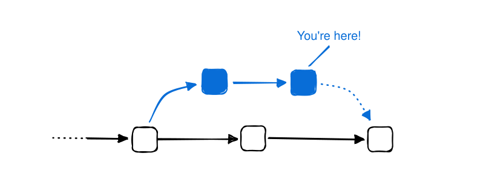

# 使用 Docker 进行持续集成

持续集成（CI）是开发过程中你希望将代码更改合并到项目主分支的部分。此时，开发团队会运行测试和构建，以审查代码更改是否不会导致任何不想要或意外的行为。

在这个开发阶段，即使你最终没有将应用程序打包为容器镜像，Docker 也有多种用途。

## 将 Docker 作为构建环境

容器是可复现的、隔离的环境，能产生可预测的结果。在 Docker 容器中构建和测试你的应用程序可以更轻松地防止意外行为的发生。使用 Dockerfile，你可以定义构建环境的确切要求，包括编程运行时、操作系统、二进制文件等等。

使用 Docker 管理你的构建环境还可以简化维护。例如，更新到新版本的编程运行时可以像更改 Dockerfile 中的标签或摘要一样简单。无需 SSH 进入一台宠物虚拟机（pet VM）手动重新安装较新版本并更新相关配置文件。

此外，正如你期望第三方开源包是安全的一样，你的构建环境也应该如此。你可以像对待任何其他容器化应用程序一样扫描和索引一个构建器镜像。

以下链接提供了如何在 CI 中使用 Docker 构建应用程序的入门说明：

- [GitHub Actions](https://docs.github.com/en/actions/creating-actions/creating-a-docker-container-action)
- [GitLab](https://docs.gitlab.com/runner/executors/docker.html)
- [Circle CI](https://circleci.com/docs/using-docker/)
- [Render](https://render.com/docs/docker)

### Docker in Docker

你也可以使用 Docker 化的构建环境，通过 Docker 来构建容器镜像。也就是说，你的构建环境运行在一个容器内部，而这个容器本身配备了运行 Docker 构建的能力。这种方法被称为 "Docker in Docker"（Docker 嵌套）。

Docker 提供了一个官方的 [Docker 镜像](https://hub.docker.com/_/docker)，你可以用于此目的。

## 下一步

Docker 维护了一组官方的 GitHub Actions，你可以用于在 GitHub Actions 平台上构建、注解和推送容器镜像。请参阅 [GitHub Actions 简介](github-actions/_index.md) 了解更多信息并开始使用。

