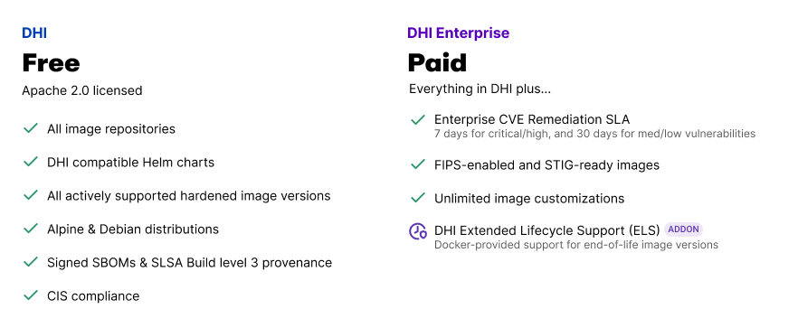

Docker Hardened Images (DHI) 是由 Docker 维护的精简、安全且可用于生产环境的容器基础镜像和应用程序镜像。旨在减少漏洞并简化合规性，DHI 可以轻松集成到您现有的基于 Docker 的工作流中，几乎无需重新调整工具。

DHI 提供两个版本：**DHI Free** 免费提供核心安全功能，而 **DHI Enterprise** 则为有高级需求的组织增加了 SLA 支持保障、合规性变体、定制化服务和延长生命周期支持。

探索以下部分，以开始使用 Docker Hardened Images，将它们集成到您的工作流中，并了解是什么使其安全且企业就绪。

