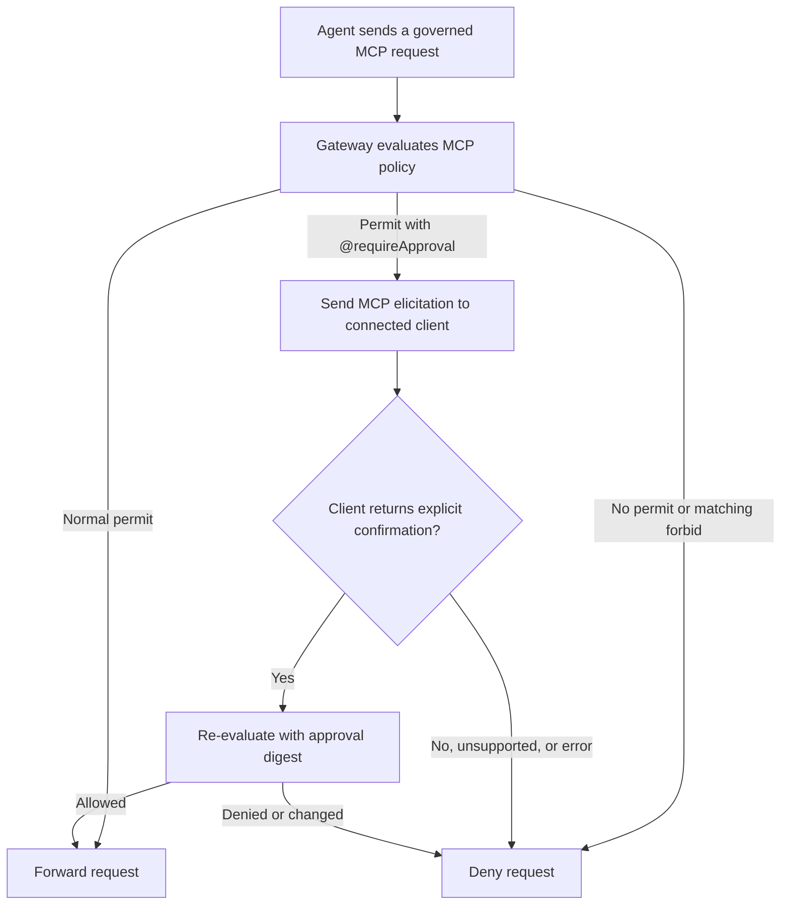

MCP 访问策略让组织管理员能够控制开发者可以注册哪些模型上下文协议（MCP）服务器，以及智能体通过 Docker 的 MCP 网关可以执行哪些操作。使用这些策略来批准受信任的服务器、撤销对某个服务器的访问、要求对工具调用进行审批，以及限制在主机上运行的服务器。要注册 MCP 服务器并将其连接到沙箱，请参阅 [MCP 网关](../../mcp-gateway.md)。

与[网络访问策略](network.md)和[文件系统访问策略](filesystem.md)不同，MCP 策略是用 Cedar 编写的组织策略。Docker 定义了 `MCP` 命名空间，包括策略可以匹配的动作、资源类型、属性与审批行为。本页聚焦于有代表性的访问模式。有关 Docker 确切的策略面，请参阅 [MCP 策略参考](../reference/mcp-policy.md)。有关 Cedar 语法与语言语义，请参阅 [Cedar 文档](https://docs.cedarpolicy.com/)。

## 治理服务器生命周期

MCP 策略在服务器生命周期的两个点上应用。针对某一点的规则不会自动治理另一点。

| 管理员决策                       | 评估点                              | 匹配依据                                                             |
| -------------------------------- | ----------------------------------- | ------------------------------------------------------------------- |
| 某个服务器是否可被注册           | 当开发者运行 `sbx mcp add` 时       | 注册名称与已解析的服务器属性，例如 `identityURL`                    |
| 智能体通过 MCP 网关可以做什么    | 当网关处理被治理的请求时            | 已注册的服务器名称、工具注解、资源 URI 或提示名称                   |

注册规则影响未来的注册。它们不会移除已保存的注册，也不会阻止使用 `sbx mcp load` 加载现有注册。使用时规则治理来自已注册或已加载服务器的工具调用、资源读取与提示获取。

服务器名称在注册期间选定。注册规则可以同时匹配所选名称与已解析的服务器身份。在使用时，工具、资源与提示与注册名称关联，因此针对某个现有服务器的规则必须匹配它被注册时使用的每一个名称。

内置网关工具（例如 `mcp-add`、`code-mode` 和 OAuth 授权辅助工具）也在使用时受到治理。它们是 `MCP::Primordial` 资源，而不是与已注册服务器关联的工具。有关细节，请参阅[内置网关工具](../../mcp-gateway.md#built-in-gateway-tools)。

使用时策略不会隐藏或移除现有注册。当智能体尝试使用工具和资源清单中被策略拒绝的条目时，这些条目也可能出现在清单里。

## 选择访问姿态

当某个用户的 MCP 策略强制执行处于生效状态时，除非有匹配的 `permit` 允许，否则注册和被治理的 MCP 请求都会被拒绝。匹配的 `forbid` 会覆盖任何 `permit`，包括带 `@requireApproval` 的 permit。

对于允许列表策略，使用 permit。对于除显式限制外均授予 MCP 活动的阻止列表策略，先从一条无动作的 permit 开始：

```plaintext
permit (principal, action, resource);
```

该语句允许每一个到达 Cedar 评估的 MCP 动作。为策略必须强制执行的限制添加 `forbid` 语句。

策略作用范围提供 principal。请使用组织或团队作用范围，而不是在 Cedar 中匹配用户、团队、租户或角色。如果某个用户的 MCP 策略强制执行未生效，网关不会评估 Cedar 策略，并允许 MCP 活动。MCP 没有与网络策略等价的本地预设。

## 批准一个服务器

对于允许列表，需同时批准服务器注册及其使用时的能力。以下策略仅在服务器以 `example` 名称并带有预期身份 URL 注册时才批准该远程服务器。它允许来自该已注册服务器的只读工具调用、资源读取与提示获取：

```plaintext
// Permit registration with the expected name and identity URL.
permit (principal, action == MCP::Action::"register", resource)
when {
  resource in MCP::Server::"example" &&
  resource.identityURL == "https://mcp.example.com/mcp"
};

// Permit read-only tool calls.
permit (principal, action == MCP::Action::"invokeTool", resource)
when {
  resource in MCP::Server::"example" &&
  resource.readOnly == true
};

// Permit resource reads.
permit (principal, action == MCP::Action::"readResource", resource)
when { resource in MCP::Server::"example" };

// Permit prompt retrieval.
permit (principal, action == MCP::Action::"getPrompt", resource)
when { resource in MCP::Server::"example" };
```

同时匹配名称和身份 URL 可确立一个规范化的注册。它可以防止开发者以已批准的名称注册另一个端点，或以另一个名称注册已批准的端点。如果用户不需要某项能力，请移除相应的资源或提示 permit。

## 使用 MCP elicitation 要求确认

使用 `@requireApproval` 通过 MCP 要求逐请求确认。当某个请求匹配被注解的 `permit` 时，网关会向发起该被治理请求的同一 MCP 客户端会话发送一个 `elicitation/create` 请求。在由人操作的客户端中，操作该智能体的人会看到提示并决定是否继续。

以下策略对以 `example` 名称注册的服务器上的非只读工具要求确认。请将它与注册该服务器或使用其其他能力所需的任何 permit 一起使用。注解字符串会成为在 elicitation 中显示的原因：

```plaintext
@requireApproval("non-read-only tool call")
permit (principal, action == MCP::Action::"invokeTool", resource)
when {
  resource in MCP::Server::"example" &&
  resource.readOnly == false
};
```

工具注解由服务器提供，属于建议性质。对于未声明 `readOnly` 的工具，其默认值为 `false`，因此该模式会对未注解的工具要求确认。

网关按如下方式处理匹配的请求：



提示会标识出服务器或网关工具，并包含注解原因。它不包含原始工具参数。每个匹配的请求都需要一次新的确认。确认后，网关会使用一个将响应绑定到已评估授权请求的摘要（digest）重新评估该请求。

请将此机制用作面向人操作客户端的确认护栏。它不会创建管理员审批或职责分离。自主的 MCP 客户端可以以编程方式响应协议内的 elicitation。对于绝不允许运行的操作，请使用 `forbid`。

如果发起请求的客户端会话无法处理 MCP elicitation、用户拒绝、elicitation 失败，或重新评估不允许该请求，则该请求被拒绝。`sbx mcp add` 无法呈现 elicitation，因此带 `@requireApproval` 的注册 permit 会导致拒绝。来自无法转发 elicitation 的执行上下文的工具调用（包括来自 `code-mode` 内部的调用）也会被拒绝。

## 撤销服务器访问

要从更宽泛规则所允许的服务器撤销访问，请在注册时和使用时都阻止它。注册策略控制未来的 `sbx mcp add` 操作，而使用时策略控制来自已注册或已加载服务器的请求。

通过匹配服务器的身份 URL 来阻止其未来的注册：

```plaintext
forbid (principal, action == MCP::Action::"register", resource)
when { resource.identityURL == "https://mcp.example.com/mcp" };
```

为指向该服务器的每一个已注册名称拒绝使用时请求：

```plaintext
forbid (principal, action == MCP::Action::"invokeTool", resource)
when { resource in MCP::Server::"example" };

forbid (principal, action == MCP::Action::"readResource", resource)
when { resource in MCP::Server::"example" };

forbid (principal, action == MCP::Action::"getPrompt", resource)
when { resource in MCP::Server::"example" };
```

该注册仍会被保存，并且仍可被列出或加载。这些规则可阻止针对该身份 URL 的另一次注册，并拒绝在该注册名称下被治理的使用。如果该服务器以其他名称注册过，请同时为那些名称添加使用时规则。

OAuth 授权辅助工具是内置网关工具，而不是已注册服务器的子项。要阻止智能体为该服务器启动授权，请单独治理该辅助工具：

```plaintext
forbid (principal, action == MCP::Action::"invokePrimordial", resource)
when { resource in MCP::Primordial::"example-authorize" };
```

## 限制在主机上运行的服务器

本地 stdio 服务器运行在主机上，位于沙箱 VM 之外。这包括显式的主机命令以及使用主机 Docker 启动的以 OCI 打包的 stdio 服务器。有关此边界的细节，请参阅 [Docker Engine 隔离](../../security/isolation.md#docker-engine-isolation)。

在一个原本允许注册的阻止列表策略中，拒绝在主机上运行的服务器类型：

```plaintext
forbid (principal, action == MCP::Action::"register", resource)
when { resource.type == "local-stdio" };
```

`local-stdio` 涵盖显式命令（包括启动 Docker 容器的命令），以及使用 `--local` 从镜像仓库或清单元数据解析出来的以 OCI 打包的 stdio 服务器。

## 相关信息

- [MCP 策略概念](../concepts.md#mcp-policies)：策略模型与规则评估。
- [MCP 策略参考](../reference/mcp-policy.md)：确切的动作、资源、属性、上下文与审批行为。
- [组织策略](organization.md)：策略创建与作用范围。
- [MCP 策略审计日志](../audit/)：策略决策记录。
