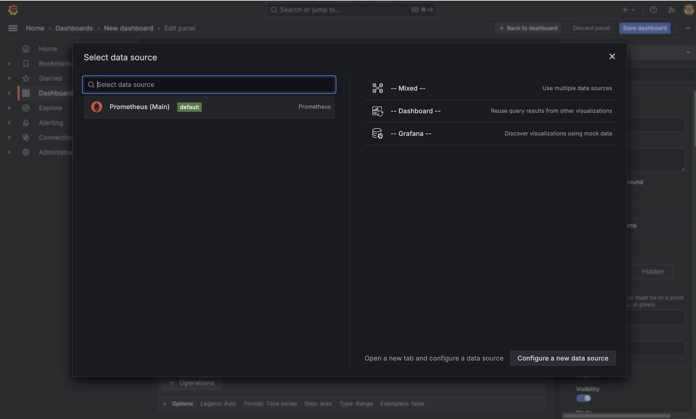
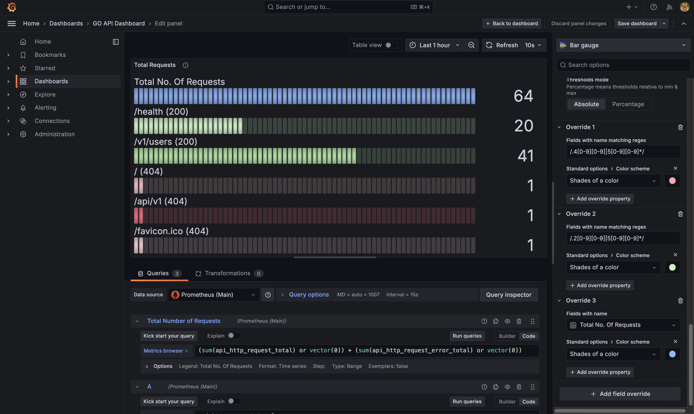

# 使用 Prometheus 和 Grafana 监控 Golang 应用


本指南将教你如何将 Golang 应用容器化，并使用 Prometheus 和 Grafana 监控它。

> **致谢**
>
> Docker 感谢 [Pradumna Saraf](https://twitter.com/pradumna_saraf) 对本指南的贡献。

## 概述

为了确保你的应用按预期工作，监控非常重要。最流行的监控工具之一是 Prometheus。Prometheus 是一个开源的监控与告警工具包，专为可靠性和可扩展性而设计。它通过抓取被监控目标的指标 HTTP 端点来从这些目标收集指标。要可视化这些指标，你可以使用 Grafana。Grafana 是一个开源的监控与可观测性平台，让你能够查询、可视化、告警并理解你的指标，无论它们存储在哪里。

在本指南中，你将创建一个带有一些端点的 Golang 服务器，以模拟一个真实世界的应用。然后你将使用 Prometheus 从服务器暴露指标。最后，你将使用 Grafana 可视化这些指标。你将对 Golang 应用进行容器化，并使用 Docker Compose 文件将所有服务连接起来：Golang、Prometheus 和 Grafana。

## 你将学到什么？

* 创建带有自定义 Prometheus 指标的 Golang 应用。
* 将 Golang 应用容器化。
* 使用 Docker Compose 运行多个服务并将它们连接在一起，以使用 Prometheus 和 Grafana 监控 Golang 应用。
* 使用 Grafana 仪表板可视化指标。

## 先决条件

- 假定你已较好地理解 Golang。
- 你必须熟悉 Prometheus 以及在 Grafana 中创建仪表板。
- 你必须熟悉容器、镜像和 Dockerfile 等 Docker 概念。如果你是 Docker 新手，可以从 [Docker 基础](/get-started/docker-concepts/the-basics/what-is-a-container.md) 指南开始。

## 后续步骤

你将创建一个 Golang 服务器，并使用 Prometheus 暴露指标。

## 构建应用

### 先决条件

* 你有一个 [Git 客户端](https://git-scm.com/downloads)。本节中的示例使用基于命令行的 Git 客户端，但你可以使用任何客户端。

你将创建一个带有一些端点的 Golang 服务器，以模拟一个真实世界的应用。然后你将使用 Prometheus 从服务器暴露指标。

### 获取示例应用

克隆与本指南配合使用的示例应用。打开终端，切换到你想工作的目录，并运行以下命令克隆仓库：

```console
$ git clone https://github.com/dockersamples/go-prometheus-monitoring.git 
```

克隆完成后，你会在 `go-prometheus-monitoring` 目录中看到以下内容结构：

```text
go-prometheus-monitoring
├── CONTRIBUTING.md
├── Docker
│   ├── grafana.yml
│   └── prometheus.yml
├── dashboard.json
├── Dockerfile
├── LICENSE
├── README.md
├── compose.yaml
├── go.mod
├── go.sum
└── main.go
```

- **main.go** - 应用的入口点。
- **go.mod 和 go.sum** - Go 模块文件。
- **Dockerfile** - 用于构建应用的 Dockerfile。
- **Docker/** - 包含 Grafana 和 Prometheus 的 Docker Compose 配置文件。
- **compose.yaml** - 用于启动一切（Golang 应用、Prometheus 和 Grafana）的 Compose 文件。
- **dashboard.json** - Grafana 仪表板配置文件。
- **Dockerfile** - 用于构建 Golang 应用的 Dockerfile。
- **compose.yaml** - 用于启动一切（Golang 应用、Prometheus 和 Grafana）的 Docker Compose 文件。
- 其他文件用于许可证和文档目的。

### 理解应用

以下是你将在 `main.go` 中找到的应用的完整逻辑。

```go
package main

import (
	"strconv"

	"github.com/gin-gonic/gin"
	"github.com/prometheus/client_golang/prometheus"
	"github.com/prometheus/client_golang/prometheus/promhttp"
)

// Define metrics
var (
	HttpRequestTotal = prometheus.NewCounterVec(prometheus.CounterOpts{
		Name: "api_http_request_total",
		Help: "Total number of requests processed by the API",
	}, []string{"path", "status"})

	HttpRequestErrorTotal = prometheus.NewCounterVec(prometheus.CounterOpts{
		Name: "api_http_request_error_total",
		Help: "Total number of errors returned by the API",
	}, []string{"path", "status"})
)

// Custom registry (without default Go metrics)
var customRegistry = prometheus.NewRegistry()

// Register metrics with custom registry
func init() {
	customRegistry.MustRegister(HttpRequestTotal, HttpRequestErrorTotal)
}

func main() {
	router := gin.Default()

	// Register /metrics before middleware
	router.GET("/metrics", PrometheusHandler())
	
	router.Use(RequestMetricsMiddleware())
	router.GET("/health", func(c *gin.Context) {
		c.JSON(200, gin.H{
			"message": "Up and running!",
		})
	})
	router.GET("/v1/users", func(c *gin.Context) {
		c.JSON(200, gin.H{
			"message": "Hello from /v1/users",
		})
	})

	router.Run(":8000")
}

// Custom metrics handler with custom registry
func PrometheusHandler() gin.HandlerFunc {
	h := promhttp.HandlerFor(customRegistry, promhttp.HandlerOpts{})
	return func(c *gin.Context) {
		h.ServeHTTP(c.Writer, c.Request)
	}
}

// Middleware to record incoming requests metrics
func RequestMetricsMiddleware() gin.HandlerFunc {
	return func(c *gin.Context) {
		path := c.Request.URL.Path
		c.Next()
		status := c.Writer.Status()
		if status < 400 {
			HttpRequestTotal.WithLabelValues(path, strconv.Itoa(status)).Inc()
		} else {
			HttpRequestErrorTotal.WithLabelValues(path, strconv.Itoa(status)).Inc()
		}
	}
}
```

在这部分代码中，你导入了所需的包 `gin`、`prometheus` 和 `promhttp`。然后你定义了几个变量，`HttpRequestTotal` 和 `HttpRequestErrorTotal` 是 Prometheus 计数器指标，`customRegistry` 是一个自定义注册表，将用于注册这些指标。指标的名称是一个字符串，你可以用它来识别该指标。help 字符串是一个字符串，当你查询 `/metrics` 端点以理解该指标时会显示出来。你使用自定义注册表的原因是，以避免 Prometheus 客户端默认注册的默认 Go 指标。然后你使用 `init` 函数将这些指标注册到自定义注册表中。

```go
import (
	"strconv"

	"github.com/gin-gonic/gin"
	"github.com/prometheus/client_golang/prometheus"
	"github.com/prometheus/client_golang/prometheus/promhttp"
)

// Define metrics
var (
	HttpRequestTotal = prometheus.NewCounterVec(prometheus.CounterOpts{
		Name: "api_http_request_total",
		Help: "Total number of requests processed by the API",
	}, []string{"path", "status"})

	HttpRequestErrorTotal = prometheus.NewCounterVec(prometheus.CounterOpts{
		Name: "api_http_request_error_total",
		Help: "Total number of errors returned by the API",
	}, []string{"path", "status"})
)

// Custom registry (without default Go metrics)
var customRegistry = prometheus.NewRegistry()

// Register metrics with custom registry
func init() {
	customRegistry.MustRegister(HttpRequestTotal, HttpRequestErrorTotal)
}
```

在 `main` 函数中，你创建了 `gin` 框架的一个新实例并创建了三条路由。你可以看到位于路径 `/health` 的健康检查端点，它将返回包含 `{"message": "Up and running!"}` 的 JSON，以及将返回包含 `{"message": "Hello from /v1/users"}` 的 JSON 的 `/v1/users` 端点。第三条路由是 `/metrics` 端点，它将以 Prometheus 格式返回指标。然后你有 `RequestMetricsMiddleware` 中间件，它将在每次对 API 发起请求时被调用。它将记录传入请求的指标，如状态码和路径。最后，你在端口 8000 上运行 gin 应用。

```golang
func main() {
	router := gin.Default()

	// Register /metrics before middleware
	router.GET("/metrics", PrometheusHandler())
	
	router.Use(RequestMetricsMiddleware())
	router.GET("/health", func(c *gin.Context) {
		c.JSON(200, gin.H{
			"message": "Up and running!",
		})
	})
	router.GET("/v1/users", func(c *gin.Context) {
		c.JSON(200, gin.H{
			"message": "Hello from /v1/users",
		})
	})

	router.Run(":8000")
}
```

现在来看中间件函数 `RequestMetricsMiddleware`。该函数在每次对 API 发起请求时被调用。如果状态码小于或等于 400，它会递增 `HttpRequestTotal` 计数器（不同路径和状态码对应不同计数器）。如果状态码大于 400，它会递增 `HttpRequestErrorTotal` 计数器（不同路径和状态码对应不同计数器）。`PrometheusHandler` 函数是自定义处理器，将在 `/metrics` 端点被调用。它将以 Prometheus 格式返回指标。

```golang
// Custom metrics handler with custom registry
func PrometheusHandler() gin.HandlerFunc {
	h := promhttp.HandlerFor(customRegistry, promhttp.HandlerOpts{})
	return func(c *gin.Context) {
		h.ServeHTTP(c.Writer, c.Request)
	}
}

// Middleware to record incoming requests metrics
func RequestMetricsMiddleware() gin.HandlerFunc {
	return func(c *gin.Context) {
		path := c.Request.URL.Path
		c.Next()
		status := c.Writer.Status()
		if status < 400 {
			HttpRequestTotal.WithLabelValues(path, strconv.Itoa(status)).Inc()
		} else {
			HttpRequestErrorTotal.WithLabelValues(path, strconv.Itoa(status)).Inc()
		}
	}
}
```

就是这样，以上是应用的完整要点。现在是时候运行并测试应用是否正确地注册指标了。

### 运行应用

确保在终端中你仍然位于 `go-prometheus-monitoring` 目录内，并运行以下命令。通过运行 `go mod tidy` 安装依赖，然后通过运行 `go run main.go` 构建并运行应用。然后访问 `http://localhost:8000/health` 或 `http://localhost:8000/v1/users`。你应该会看到输出 `{"message": "Up and running!"}` 或 `{"message": "Hello from /v1/users"}`。如果你能看到这些，说明你的应用已成功启动并正在运行。

现在，通过访问 `/metrics` 端点来检查你应用的指标。
在浏览器中打开 `http://localhost:8000/metrics`。你应该会看到类似以下内容的输出。

```sh
# HELP api_http_request_error_total Total number of errors returned by the API
# TYPE api_http_request_error_total counter
api_http_request_error_total{path="/",status="404"} 1
api_http_request_error_total{path="//v1/users",status="404"} 1
api_http_request_error_total{path="/favicon.ico",status="404"} 1
# HELP api_http_request_total Total number of requests processed by the API
# TYPE api_http_request_total counter
api_http_request_total{path="/health",status="200"} 2
api_http_request_total{path="/v1/users",status="200"} 1
```

在终端中，按 `ctrl` + `c` 停止应用。

> [!Note]
> 如果你不想在本地运行应用，而想在 Docker 容器中运行它，请跳到下一页，在那里你将创建 Dockerfile 并将应用容器化。

### 总结

在本节中，你学习了如何创建一个 Golang 应用来向 Prometheus 注册指标。通过实现中间件函数，你能够根据请求路径和状态码递增计数器。

### 后续步骤

在下一节中，你将学习如何将应用容器化。

## 将 Golang 应用容器化

容器化有助于你将应用及其依赖项打包到一个称为容器的单一包中。这个包可以在任何平台上运行，而无需担心环境。在本节中，你将学习如何使用 Docker 将 Golang 应用容器化。

要将 Golang 应用容器化，你首先需要创建一个 Dockerfile。Dockerfile 包含用于在容器中构建和运行应用的指令。此外，在创建 Dockerfile 时，你可以遵循不同的最佳实践，以优化镜像大小并使其更安全。

### 创建 Dockerfile

在你的 Golang 应用根目录中创建一个名为 `Dockerfile` 的新文件。Dockerfile 包含用于在容器中构建和运行应用的指令。

以下是一个用于 Golang 应用的 Dockerfile。你也可以在 `go-prometheus-monitoring` 目录中找到这个文件。

```dockerfile
# Use the official Golang image as the base
FROM golang:1.24-alpine AS builder

# Set environment variables
ENV CGO_ENABLED=0 \
    GOOS=linux \
    GOARCH=amd64

# Set working directory inside the container
WORKDIR /build

# Copy go.mod and go.sum files for dependency installation
COPY go.mod go.sum ./

# Download dependencies
RUN go mod download

# Copy the entire application source
COPY . .

# Build the Go binary
RUN go build -o /app .

# Final lightweight stage
FROM alpine:3.21 AS final

# Copy the compiled binary from the builder stage
COPY --from=builder /app /bin/app

# Expose the application's port
EXPOSE 8000

# Run the application
CMD ["bin/app"]
```

### 理解 Dockerfile

Dockerfile 由两个阶段组成：

1. **构建阶段**：该阶段使用官方的 Golang 镜像作为基础，并设置必要的环境变量。它还设置了容器内的工作目录，复制 `go.mod` 和 `go.sum` 文件以安装依赖，下载依赖，复制整个应用源码，并构建 Go 二进制文件。

    你使用 `golang:1.24-alpine` 镜像作为构建阶段的基础镜像。`CGO_ENABLED=0` 环境变量禁用了 CGO，这对于构建静态二进制文件很有用。你还将 `GOOS` 和 `GOARCH` 环境变量分别设置为 `linux` 和 `amd64`，以针对 Linux 平台构建二进制文件。

2. **最终阶段**：该阶段使用官方的 Alpine 镜像作为基础，并从构建阶段复制已编译的二进制文件。它还暴露了应用的端口并运行应用。

    你使用 `alpine:3.21` 镜像作为最终阶段的基础镜像。你从构建阶段将已编译的二进制文件复制到最终镜像中。你使用 `EXPOSE` 指令暴露应用的端口，并使用 `CMD` 指令运行应用。

    除了多阶段构建之外，Dockerfile 还遵循了诸如使用官方镜像、设置工作目录以及仅复制必要文件到最终镜像等最佳实践。你还可以通过其他最佳实践进一步优化 Dockerfile。

### 构建 Docker 镜像并运行应用

有了 Dockerfile 之后，你可以构建 Docker 镜像并在容器中运行应用。

要构建 Docker 镜像，请在终端运行以下命令：

```console
$ docker build -t go-api:latest .
```

构建镜像后，你可以使用以下命令在容器中运行应用：

```console
$ docker run -p 8000:8000 go-api:latest
```

应用将在容器内开始运行，你可以在 `http://localhost:8000` 访问它。你也可以使用 `docker ps` 命令查看正在运行的容器。

```console
$ docker ps
```

### 总结

在本节中，你学习了如何使用 Dockerfile 将 Golang 应用容器化。你创建了一个多阶段 Dockerfile 来在容器中构建并运行应用。你还了解了优化 Docker 镜像大小并使其更安全的最佳实践。

相关信息：

 - [Dockerfile 参考](/reference/dockerfile.md)
 - [.dockerignore 文件](/reference/dockerfile.md#dockerignore-file)

### 后续步骤

在下一节中，你将学习如何使用 Docker Compose 将多个服务连接在一起并运行，以使用 Prometheus 和 Grafana 监控 Golang 应用。

## 使用 Docker Compose 连接服务

既然你已经将 Golang 应用容器化，你将使用 Docker Compose 将你的服务连接在一起。你将把 Golang 应用、Prometheus 和 Grafana 服务连接在一起，以使用 Prometheus 和 Grafana 监控 Golang 应用。

### 创建 Docker Compose 文件

在你的 Golang 应用根目录中创建一个名为 `compose.yml` 的新文件。Docker Compose 文件包含运行多个服务并将它们连接在一起的指令。

以下是一个使用 Golang、Prometheus 和 Grafana 的项目的 Docker Compose 文件。你也可以在 `go-prometheus-monitoring` 目录中找到这个文件。

```yaml
services:
  api:
    container_name: go-api
    build:
      context: .
      dockerfile: Dockerfile
    image: go-api:latest
    ports:
      - 8000:8000
    networks:
      - go-network
    healthcheck:
      test: ["CMD", "curl", "-f", "http://localhost:8000/health"]
      interval: 30s
      timeout: 10s
      retries: 5
    develop:
      watch:
        - path: .
          action: rebuild
      
  prometheus:
    container_name: prometheus
    image: prom/prometheus:v2.55.0
    volumes:
      - ./Docker/prometheus.yml:/etc/prometheus/prometheus.yml
    ports:
      - 9090:9090
    networks:
      - go-network
  
  grafana:
    container_name: grafana
    image: grafana/grafana:11.3.0
    volumes:
      - ./Docker/grafana.yml:/etc/grafana/provisioning/datasources/datasource.yaml
      - grafana-data:/var/lib/grafana
    ports:
      - 3000:3000
    networks:
      - go-network
    environment:
      - GF_SECURITY_ADMIN_USER=admin
      - GF_SECURITY_ADMIN_PASSWORD=password

volumes:
  grafana-data:

networks:
  go-network:
    driver: bridge
```

### 理解 Docker Compose 文件

Docker Compose 文件由三个服务组成：

- **Golang 应用服务**：该服务使用 Dockerfile 构建 Golang 应用并在容器中运行它。它暴露应用的端口 `8000` 并连接到 `go-network` 网络。它还定义了一个健康检查来监控应用的健康状况。你也可以使用 `healthcheck` 来监控应用的健康状况。健康检查每 30 秒运行一次，如果健康检查失败，将重试 5 次。健康检查使用 `curl` 命令检查应用的 `/health` 端点。除了健康检查，你还添加了一个 `develop` 部分来监视应用源码的变化，并使用 Docker Compose Watch 功能重建应用。

- **Prometheus 服务**：该服务在容器中运行 Prometheus 服务器。它使用官方的 Prometheus 镜像 `prom/prometheus:v2.55.0`。它在端口 `9090` 上暴露 Prometheus 服务器并连接到 `go-network` 网络。你还挂载了位于项目根目录 `Docker` 目录中的 `prometheus.yml` 文件。`prometheus.yml` 文件包含用于从 Golang 应用抓取指标的 Prometheus 配置。这就是你将 Prometheus 服务器连接到 Golang 应用的方式。

    ```yaml
    global:
      scrape_interval: 10s
      evaluation_interval: 10s

    scrape_configs:
      - job_name: myapp
        static_configs:
          - targets: ["api:8000"]
    ```

    在 `prometheus.yml` 文件中，你定义了一个名为 `myapp` 的 job 来从 Golang 应用抓取指标。`targets` 字段指定了要抓取指标的目标。在本例中，目标是在端口 `8000` 上运行的 Golang 应用。`api` 是 Docker Compose 文件中 Golang 应用的服务名。Prometheus 服务器将每 10 秒从 Golang 应用抓取一次指标。

- **Grafana 服务**：该服务在容器中运行 Grafana 服务器。它使用官方的 Grafana 镜像 `grafana/grafana:11.3.0`。它在端口 `3000` 上暴露 Grafana 服务器并连接到 `go-network` 网络。你还挂载了位于项目根目录 `Docker` 目录中的 `grafana.yml` 文件。`grafana.yml` 文件包含用于添加 Prometheus 数据源的 Grafana 配置。这就是你将 Grafana 服务器连接到 Prometheus 服务器的方式。在环境变量中，你设置了 Grafana 管理员用户和密码，它们将用于登录 Grafana 仪表板。

    ```yaml
    apiVersion: 1
    datasources:
    - name: Prometheus (Main)
      type: prometheus
      url: http://prometheus:9090
      isDefault: true
    ```
      
    在 `grafana.yml` 文件中，你定义了一个名为 `Prometheus (Main)` 的 Prometheus 数据源。`type` 字段指定了数据源的类型，即 `prometheus`。`url` 字段指定了用于获取指标的 Prometheus 服务器的 URL。在本例中，URL 是 `http://prometheus:9090`。`prometheus` 是 Docker Compose 文件中 Prometheus 服务器的服务名。`isDefault` 字段指定该数据源是否为 Grafana 中的默认数据源。

除了服务之外，Docker Compose 文件还定义了一个名为 `grafana-data` 的卷来持久化 Grafana 数据，以及一个名为 `go-network` 的网络来将服务连接在一起。你创建了一个自定义网络 `go-network` 来将服务连接在一起。`driver: bridge` 字段指定了用于该网络的网络驱动。

### 构建并运行服务

既然你有了 Docker Compose 文件，你就可以使用 Docker Compose 构建服务并一起运行它们。

要构建并运行服务，请在终端运行以下命令：

```console
$ docker compose up
```

`docker compose up` 命令构建 Docker Compose 文件中定义的服务并一起运行它们。你会在终端中看到类似的输出：

```console
 ✔ Network go-prometheus-monitoring_go-network  Created                                                           0.0s 
 ✔ Container grafana                            Created                                                           0.3s 
 ✔ Container go-api                             Created                                                           0.2s 
 ✔ Container prometheus                         Created                                                           0.3s 
Attaching to go-api, grafana, prometheus
go-api      | [GIN-debug] [WARNING] Creating an Engine instance with the Logger and Recovery middleware already attached.
go-api      | 
go-api      | [GIN-debug] [WARNING] Running in "debug" mode. Switch to "release" mode in production.
go-api      |  - using env:     export GIN_MODE=release
go-api      |  - using code:    gin.SetMode(gin.ReleaseMode)
go-api      | 
go-api      | [GIN-debug] GET    /metrics                  --> main.PrometheusHandler.func1 (3 handlers)
go-api      | [GIN-debug] GET    /health                   --> main.main.func1 (4 handlers)
go-api      | [GIN-debug] GET    /v1/users                 --> main.main.func2 (4 handlers)
go-api      | [GIN-debug] [WARNING] You trusted all proxies, this is NOT safe. We recommend you to set a value.
go-api      | Please check https://pkg.go.dev/github.com/gin-gonic/gin#readme-don-t-trust-all-proxies for details.
go-api      | [GIN-debug] Listening and serving HTTP on :8000
prometheus  | ts=2025-03-15T05:57:06.676Z caller=main.go:627 level=info msg="No time or size retention was set so using the default time retention" duration=15d
prometheus  | ts=2025-03-15T05:57:06.678Z caller=main.go:671 level=info msg="Starting Prometheus Server" mode=server version="(version=2.55.0, branch=HEAD, revision=91d80252c3e528728b0f88d254dd720f6be07cb8)"
grafana     | logger=settings t=2025-03-15T05:57:06.865335506Z level=info msg="Config overridden from command line" arg="default.log.mode=console"
grafana     | logger=settings t=2025-03-15T05:57:06.865337131Z level=info msg="Config overridden from Environment variable" var="GF_PATHS_DATA=/var/lib/grafana"
grafana     | logger=ngalert.state.manager t=2025-03-15T05:57:07.088956839Z level=info msg="State
.
.
grafana     | logger=plugin.angulardetectorsprovider.dynamic t=2025-03-15T05:57:07.530317298Z level=info msg="Patterns update finished" duration=440.489125ms
```

服务将开始运行，你可以在 `http://localhost:8000` 访问 Golang 应用，在 `http://localhost:9090/health` 访问 Prometheus，在 `http://localhost:3000` 访问 Grafana。你也可以使用 `docker ps` 命令查看正在运行的容器。

```console
$ docker ps
```

### 总结

在本节中，你学习了如何使用 Docker Compose 将服务连接在一起。你创建了一个 Docker Compose 文件来一起运行多个服务并使用网络将它们连接。你还学习了如何使用 Docker Compose 构建并运行服务。

相关信息：

 - [Docker Compose 概述](/manuals/compose/_index.md)
 - [Compose 文件参考](/reference/compose-file/_index.md)

接下来，你将学习如何使用 Docker Compose 开发 Golang 应用，并使用 Prometheus 和 Grafana 监控它。

### 后续步骤

在下一节中，你将学习如何使用 Docker 开发 Golang 应用。你还将学习如何在每次修改代码时使用 Docker Compose Watch 重建镜像。最后，你将测试应用，并使用 Prometheus 作为数据源在 Grafana 中可视化指标。

## 开发你的应用

在上一节中，你看到了如何使用 Docker Compose 将服务连接在一起。在本节中，你将学习如何使用 Docker 开发 Golang 应用。你还将看到如何在每次修改代码时使用 Docker Compose Watch 重建镜像。最后，你将测试应用，并使用 Prometheus 作为数据源在 Grafana 中可视化指标。

### 开发应用

现在，如果你在本地对 Golang 应用做了任何修改，它需要在容器中反映出来，对吧？为此，一种方法是在修改代码后使用 Docker Compose 中的 `--build` 标志。这将重建所有在 `compose.yml` 文件中包含 `build` 指令的服务，在你的例子中，即 `api` 服务（Golang 应用）。

```console
docker compose up --build
```

但是，这不是最好的方法。这并不高效。每次你修改代码，都需要手动重建。这不是一个好的开发流程。

更好的方法是使用 Docker Compose Watch。在 `compose.yml` 文件中，在 `api` 服务下，你添加了 `develop` 部分。所以，这更像是一个热重载。每当你修改代码（在 `path` 中定义）时，它将重建镜像（或根据 action 重启）。以下是你使用它的方式：

```yaml {hl_lines="17-20",linenos=true}
services:
  api:
    container_name: go-api
    build:
      context: .
      dockerfile: Dockerfile
    image: go-api:latest
    ports:
      - 8000:8000
    networks:
      - go-network
    healthcheck:
      test: ["CMD", "curl", "-f", "http://localhost:8080/health"]
      interval: 30s
      timeout: 10s
      retries: 5
    develop:
      watch:
        - path: .
          action: rebuild
```

一旦你在 `compose.yml` 文件中添加了 `develop` 部分，你可以使用以下命令启动开发服务器：

```console
$ docker compose watch
```

现在，如果你修改了 `main.go` 或项目中的任何其他文件，`api` 服务将自动重建。你将在终端中看到以下输出：

```bash
Rebuilding service(s) ["api"] after changes were detected...
[+] Building 8.1s (15/15) FINISHED                                                                                                        docker:desktop-linux
 => [api internal] load build definition from Dockerfile                                                                                                  0.0s
 => => transferring dockerfile: 704B                                                                                                                      0.0s
 => [api internal] load metadata for docker.io/library/alpine:3.17                                                                                        1.1s
  .                             
 => => exporting manifest list sha256:89ebc86fd51e27c1da440dc20858ff55fe42211a1930c2d51bbdce09f430c7f1                                                    0.0s
 => => naming to docker.io/library/go-api:latest                                                                                                          0.0s
 => => unpacking to docker.io/library/go-api:latest                                                                                                       0.0s
 => [api] resolving provenance for metadata file                                                                                                          0.0s
service(s) ["api"] successfully built
```

### 测试应用

现在你的应用已经在运行，前往 Grafana 仪表板来可视化你正在注册的指标。打开浏览器并访问 `http://localhost:3000`。你将看到 Grafana 登录页面。登录凭据是 Compose 文件中提供的那些。

登录后，你可以创建一个新的仪表板。在创建仪表板时，你会注意到默认数据源是 `Prometheus`。这是因为你已经在 `grafana.yml` 文件中配置了该数据源。



你可以使用不同的面板来可视化指标。本指南不深入介绍 Grafana 的细节。你可以参考 [Grafana 文档](https://grafana.com/docs/grafana/latest/) 了解更多信息。有一个 Bar Gauge 面板用于可视化来自不同端点的请求总数。你使用了 `api_http_request_total` 和 `api_http_request_error_total` 指标来获取数据。



你创建了这个面板来可视化来自不同端点的请求总数，以比较成功和失败的请求。对于所有正常的请求，条形将为绿色；对于所有失败的请求，条形将为红色。此外，它还会显示请求来自哪个端点，无论是成功请求还是失败请求。如果你想使用这个面板，可以导入你克隆的仓库中的 `dashboard.json` 文件。

### 总结

你已经来到了本指南的结尾。你学习了如何使用 Docker 开发 Golang 应用。你也看到了如何在每次修改代码时使用 Docker Compose Watch 重建镜像。最后，你测试了应用，并使用 Prometheus 作为数据源在 Grafana 中可视化了指标。

